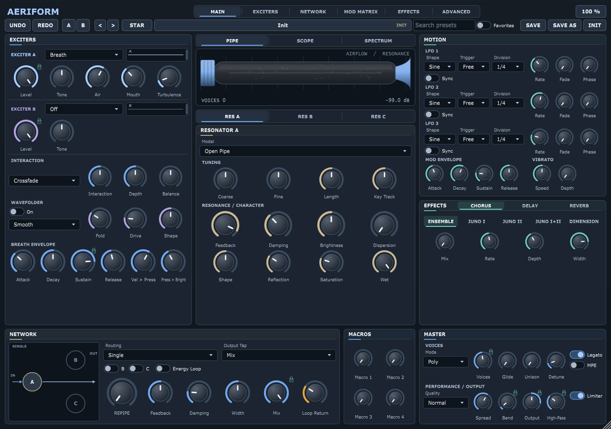

# EXP_Aeriform experimental branch

This branch contains the independent EXP_Aeriform synth, with a distinct VST3 identity from the original AERIFORM. Windows test binaries are included in [artifacts/windows-x64](artifacts/windows-x64); see [the test-build notes](artifacts/windows-x64/README.md) for installation, validation and current limitations.

Implemented additions include A/B parameter/deep morphing, seeded patch tools and locks, undo/favourites, three movable filters, collision routing, physical stereo, a shared sympathetic bank, coupled room, resonant delay and shimmer. Spectral-freeze DSP is included through host parameters; its dedicated page is pending. Multiband saturation, a separate FX target and the final realtime/performance audit remain unfinished. Original factory sounds are preserved; new modules default off.

The baseline project documentation follows.

# AERIFORM

**An oscillator-free physical-modelling synthesizer with a complex exciter
generator and a three-resonator feedback network.**
VST3 + Standalone, 8-voice polyphonic (up to 16), MPE, sidechain excitation.
C++20 / JUCE 7.0.12 / CMake. Version 2.1.



AERIFORM started (v0.1) as a breath-driven waveguide instrument: air, noise,
plucks or sidechain audio pushed into a tuned tube whose reflections, losses,
dispersion and reed junction shape the tone. Version 2.1 turns the front end
into a **dual-exciter complex generator** (conventional band-limited waveforms,
an original chaotic "orbit" oscillator, a noise laboratory, physical exciters
and the sidechain) with **thirteen interaction modes**, a **pre-shaper** and an
**oversampled wavefolder**, and turns the back end into a **network of three
resonators** (nine models: pipes, string, comb, dispersive tube, modal bank,
metallic bar, membrane, formant body) with serial / parallel / hybrid routing,
six governed cross-feedback routes, a **Repipe** macro and an optional,
bounded **energy loop**. Every v0.1 sound, preset and session loads unchanged.

It is inspired by the general concept of exciter -> resonator -> space
instruments. It is an original design and contains no code, algorithms,
presets, panel layouts, artwork or branding from any other product.

---

## Contents

1. [Features](#features)
2. [What changed in v2.1](#what-changed-in-v21)
3. [Building on Windows](#building-on-windows)
4. [macOS and Linux](#macos-and-linux)
5. [Installing and running](#installing-and-running)
6. [Tests and validation](#tests-and-validation)
7. [Playing it: pages, sidechain, MPE, MIDI learn](#playing-it)
8. [Architecture](#architecture)
9. [DSP: the exciter chain](#dsp-the-exciter-chain)
10. [DSP: the resonator network](#dsp-the-resonator-network)
11. [Stability and safety](#stability-and-safety)
12. [Parameters and compatibility](#parameters-and-compatibility)
13. [Presets](#presets)
14. [Performance](#performance)
15. [Known limitations](#known-limitations)
16. [Licensing](#licensing)

---

## Features

- **Two exciter slots (A / B)**, each with a model selector:
  - *Breath*: the v0.1 exciter (noise, pressure, pluck, transient, release puff,
    sidechain knob), bit-for-bit the same behaviour.
  - *Wave*: PolyBLEP band-limited morphing oscillator (sine -> triangle -> saw
    -> pulse), pulse width, sub oscillator, phase distortion, hard sync (B to A).
  - *Complex*: an original "orbit" oscillator: two phase-coupled operators with
    self-feedback, bend, phase warp, a detuned spread pair, a bounded logistic
    chaos map advanced once per cycle and an instability random walk.
  - *Noise laboratory*: white, pink, brown, blue, violet, band-limited, velvet,
    crackle, steam, wind, aerosol and metallic noise, with colour, density,
    grain, bandwidth, centre, per-voice / shared correlation, **seed** (a preset
    always plays the same noise), width, burst length and shape, turbulence and
    gust rate.
  - *Physical exciters*: reed, lip, bow, jet (sustained models with their own
    small bore loops), mallet, pluck, scrape, impact (one-shots), with
    stiffness, opening, position, speed, turbulence, hardness and brightness.
  - *Sidechain*: the host's sidechain bus (or the standalone's microphone) with
    low-pass / high-pass, envelope follower, transient extraction and a **Freeze**
    that loops the last 250 ms (not stored, no recording, no sample storage).
  - Common per slot: level, coarse / fine tune, key tracking, phase mode
    (free / retrigger / random), start phase, tone, per-voice variation,
    velocity, pressure, drift.
- **Interaction stage**: crossfade, add, subtract, ring, AM, FM, PM, sync, XOR,
  min / max, rectified difference, sample & hold, audio-rate crossfade; central
  Interaction control, balance, depth, B -> A (pitch / phase), A -> B
  (amplitude), DC block, normaliser, pre-fold drive.
- **Pre-shaper**: the v0.1 key-tracked low-pass / high-pass (same parameters)
  or a band-pass, resonance, drive, bias, slew, transient emphasis, envelope
  amount, and the order relative to the folder.
- **Wavefolder**: seven original folding functions (smooth, triangle, sine,
  diode, Chebyshev, hard, hybrid), fold, drive, symmetry, bias, 1-4 stages,
  shape, mix, compensation, post low-pass; **2x or 4x oversampled** with a
  polyphase IIR halfband, bounded and DC-free; transfer-curve display.
- **Resonator network**: three slots, nine models each (open pipe, closed pipe,
  string, comb, dispersive tube, modal bank, metallic bar, membrane, formant
  body), Single / Serial / Parallel / Hybrid routing, injection point, output
  tap, per-slot input / output / pan / width, six cross-feedback routes with
  shared delay, filter, drive, polarity and damping, network width and wet /
  dry, the **Repipe** macro (single tube -> cross-fed serial network in one
  knob), an energy governor and an **interactive network diagram**.
- **Energy loop** (experimental, off by default): filtered, delayed, saturated
  resonator energy returned into the pre-shaper, folder or network input.
- **Motion**: 3 LFOs, a modulation ADSR and a **16-slot matrix** with 29 sources
  (LFOs, envelopes, velocity, wheel, aftertouch, bend, MPE slide, key track,
  random, breath / expression CC, exciter envelopes, sidechain envelope,
  resonator and network energies, sample & hold, smooth random, chaos X / Y,
  note age, key position, voice number, alternate note) and 52 destinations.
- **Voices**: 1-16 voices, poly / mono / legato, glide, unison 1-4 with detune
  and spread, bend range, sustain / sostenuto pedals, aftertouch, **MPE**.
- **Space**: ensemble chorus, tempo-synced ping-pong delay, FDN reverb, final
  high-pass and a soft limiter.
- **Quality**: Eco / Normal / High (1x-2x / 2x / 4x exciter-chain oversampling).
- **Presets**: 40 factory presets (20 v0.1 + 20 v2.1 experimental), user
  presets as portable XML files, import / export, dirty indicator.
- **GUI**: five pages (MAIN, EXCITERS, NETWORK, MOTION, SPACE), context-sensitive
  exciter modules with live waveform scopes, wavefolder transfer display,
  interactive network diagram with live resonator energies, airflow visualiser,
  tooltips on every control, value readouts, double-click reset, shift-drag fine
  control, right-click MIDI learn, modulation rings, 60-200 % scaling.
- **Engineering**: 353 automatable parameters; state version 2 with migration;
  every v0.1 parameter ID kept with its exact meaning; no allocation / locks /
  I/O on the audio thread after `prepare`; denormal, NaN / Inf and level safety
  nets; 64 unit tests, 8 offline smoke / fuzz tests, a VST3 host-load checker
  and pluginval at strictness 10.

---

## What changed in v2.1

| Area | v0.1 | v2.1 |
|---|---|---|
| Exciter | one breath / pluck / sidechain exciter | two slots, 25 models each, interaction stage, pre-shaper, oversampled wavefolder |
| Resonator | one waveguide (3 topologies) + body | three slots, 9 models, routing, cross-feedback, Repipe, energy loop, governor |
| Matrix | 8 slots, 15 sources, 23 destinations | 16 slots, 29 sources, 52 destinations |
| Parameters | 120 | 353 (all 120 old IDs unchanged) |
| Presets | 20 | 40 |
| GUI | one page | five pages, scopes, transfer curve, network diagram |
| Tests | 33 unit + 5 smoke | 64 unit + 8 smoke (incl. multi-minute fuzz, CPU profile, editor) |

A v0.1 session or preset loads with Exciter A = Breath, B = Off, the folder off,
Single routing and the loop off, which is exactly the v0.1 signal path; the
default chord renders at the same level as before (checked by the smoke suite).

---

## Building on Windows

### Prerequisites

| Tool | Version used | Notes |
|---|---|---|
| CMake | 3.22+ (3.31 bundled with the toolchain below) | |
| Ninja | 1.12 | bundled with the toolchain below |
| C++20 compiler | **GCC 14.2 MinGW-w64 (WinLibs, POSIX threads, UCRT)** or Visual Studio 2022 | |
| Git | any | to fetch JUCE if `external/JUCE` is absent |
| Python 3 | any | only to regenerate the parameter table (`scripts/gen_params.py`) |

No admin rights are required for the MinGW path. JUCE 7.0.12 is vendored in
`external/JUCE` (shallow clone). If the folder is missing, CMake fetches it
automatically with `FetchContent`.

### Toolchain setup (portable, no installer)

1. Download `winlibs-x86_64-posix-seh-gcc-14.2.0-mingw-w64ucrt-12.0.0-r3.zip`
   from <https://github.com/brechtsanders/winlibs_mingw/releases>.
2. Extract it so that `g++.exe`, `ninja.exe` and `cmake.exe` are in
   `D:\dev\tools\mingw64\bin` (any folder works: set the environment variable
   `AERIFORM_TOOLCHAIN` to that `bin` directory).

### Build (exact commands)

From the repository root, in PowerShell:

```powershell
powershell -ExecutionPolicy Bypass -File scripts\build.ps1            # Release build
powershell -ExecutionPolicy Bypass -File scripts\build.ps1 -Test      # build + unit + smoke tests
powershell -ExecutionPolicy Bypass -File scripts\build.ps1 -Config Debug
```

or from Git Bash:

```bash
scripts/build.sh                 # Release
scripts/build.sh Release --test  # build + tests
```

Equivalent manual commands:

```powershell
$env:PATH = "D:\dev\tools\mingw64\bin;" + $env:PATH
cmake --preset mingw-release -B D:\dev\build\aeriform\mingw-release
cmake --build D:\dev\build\aeriform\mingw-release --parallel
```

**Build directory location.** CMake's Ninja generator wraps JUCE's post-build
steps in `cmd.exe /C "cd /D <dir> && ..."`, which breaks when the path contains
`^` (cmd's escape character). The scripts therefore build under
`D:\dev\build\aeriform` when the source path contains `^`, and under `build\`
inside the repository otherwise. Override with `AERIFORM_BUILD_ROOT`.

**Parameter table.** `Source/Params/ParamIDs.h` and `ParamTable.inc` are
generated from `scripts/gen_params.py` (the single source of truth for IDs,
ranges, defaults, units and tooltips). After editing the script run
`python scripts/gen_params.py` and rebuild; the parameter tests verify the
generated table.

### Visual Studio 2022

```powershell
cmake --preset msvc
cmake --build --preset msvc-release
```

(Configured but not exercised on the development machine, which has no Visual
Studio installed.)

### Build outputs

| Artefact | Path (Release, MinGW preset) |
|---|---|
| VST3 bundle | `<build>/Aeriform_artefacts/Release/VST3/AERIFORM.vst3/` |
| Standalone | `<build>/Aeriform_artefacts/Release/Standalone/AERIFORM.exe` |
| Tests | `<build>/AeriformTests.exe` |
| Host checker | `<build>/AeriformHostCheck_artefacts/Release/AeriformHostCheck.exe` |

The Windows binaries are statically linked against the compiler runtime
(`-static -static-libgcc -static-libstdc++`), so the VST3 depends only on
system DLLs and the Universal CRT that ships with Windows 10 / 11.

---

## macOS and Linux

The project is generator-agnostic. Untested on those platforms here, but the
intended commands are:

```bash
cmake --preset unix-release          # Ninja, Release
cmake --build --preset unix-release
```

- macOS: Xcode command-line tools; the `AU` format is added automatically.
- Linux: install the usual JUCE dependencies (`libasound2-dev libjack-jackd2-dev
  libfreetype6-dev libx11-dev libxrandr-dev libxinerama-dev libxcursor-dev
  libcurl4-openssl-dev libgl1-mesa-dev`), then the commands above.

---

## Installing and running

**VST3 (Windows):** copy the whole `AERIFORM.vst3` folder to
`C:\Program Files\Common Files\VST3\` (or configure `-DAERIFORM_COPY_PLUGIN=ON`
to copy after every build). Rescan plug-ins in your DAW; AERIFORM appears as an
instrument by "Aeriform Audio".

**Standalone:** run `AERIFORM.exe`. Use *Options -> Audio/MIDI Settings* to pick
the audio device, sample rate, buffer size and MIDI input. The standalone mutes
the audio input by default (feedback protection): untick *Mute audio input* to
blow into a microphone and let it drive the resonators (see Sidechain below).

---

## Tests and validation

```powershell
D:\dev\build\aeriform\mingw-release\AeriformTests.exe            # 64 unit tests (~1 min)
D:\dev\build\aeriform\mingw-release\AeriformTests.exe --smoke    # 8 offline smoke / fuzz / profile tests (~6 min)
D:\dev\build\aeriform\mingw-release\AeriformTests.exe --all      # both
D:\dev\build\aeriform\mingw-release\AeriformTests.exe --filter=<substring>   # a subset (unit or smoke)
D:\dev\build\aeriform\mingw-release\AeriformTests.exe --params > docs\PARAMETERS.md   # regenerate the parameter reference
ctest --test-dir D:\dev\build\aeriform\mingw-release             # same via CTest
```

Environment knobs: `AERIFORM_FUZZ_SECONDS` (default 60; the reported run used
90) and `AERIFORM_PROFILE_SECONDS` (default 4) lengthen the fuzz and the CPU
profile.

**Unit tests (64).** Everything from v0.1 (tuning at three sample rates,
boundedness, envelopes, effects, parameters, state, presets, voices, MPE,
sidechain) plus: every exciter model finite and audible in both slots; seeded
noise determinism (same seed = same signal, different seed = different
signal, per-voice vs shared correlation); wave-oscillator tuning and alias
level (folded 25th harmonic of a saw at 70 dB below the fundamental); the
complex oscillator's boundedness across chaos / feedback / instability; every
interaction mode with both slots in every model family; wavefolder
boundedness, DC removal and harmonic generation for every mode / symmetry /
bias / stage count; halfband oversampler pass-band and image rejection;
quality switching during playback; every resonator model tuned (spectral
peak) and distinct; every routing mode; every cross-feedback route at maximum
with both polarities; topology changes while notes play (no clicks, no level
explosion, limiter off); energy loop off by default and bounded at maximum for
every source / destination / polarity; Repipe transitions; voice stealing
under complex routing; state version 2 round trip of every new parameter;
v0.1 session and preset files loading with the old values restored and the
new parameters at their v0.1-equivalent defaults; all 40 factory presets
loading and sounding; sample-rate / block-size changes; rapid automation; the
editor opening, painting every page at three scales, binding every control to
an existing parameter, following model / mode changes and surviving open /
close cycles while playing.

**Smoke tests (8).** Three sample rates x three block sizes; extreme
settings; preset and parameter sweeps while playing; prepare / release
cycling; the **randomised fuzz** (every parameter, voice count, notes, sample
rate, block size and sidechain randomised for `AERIFORM_FUZZ_SECONDS` of audio
across many configurations, verifying finite, bounded and DC-free output and
reporting the worst block time); the CPU profile matrix (see
[docs/PERFORMANCE.md](docs/PERFORMANCE.md)); the factory-preset level check;
and the v0.1 CPU measurements.

**VST3 host check** (loads the built bundle through JUCE's VST3 hosting like a
DAW would):

```powershell
cd D:\dev\build\aeriform\mingw-release
AeriformHostCheck_artefacts\Release\AeriformHostCheck.exe Aeriform_artefacts\Release\VST3\AERIFORM.vst3 --editor
```

**pluginval** (Tracktion's validator, installed to `D:\dev\tools\pluginval`):

```powershell
D:\dev\tools\pluginval\pluginval.exe --strictness-level 10 --validate-in-process --validate D:\dev\build\aeriform\mingw-release\Aeriform_artefacts\Release\VST3\AERIFORM.vst3
```

Last results (v2.1 build): unit 64 / 0 failures, smoke 8 / 0 failures (fuzz 93 s
over 25 configurations), host check PASSED, pluginval strictness 10
**SUCCESS**.

---

## Playing it

**Pages.** MAIN is the playing page: both exciters in compact form (model,
level, tone and the three most characteristic controls of the chosen model),
interaction, folder essentials, breath envelope, the airflow visualiser,
Resonator A, the network overview with the Repipe macro, motion (matrix slots
1-8) and master. EXCITERS shows both slots in full with waveform scopes, the
interaction (with a one-line hint per mode), pre-shaper, envelope /
articulation and the wavefolder with its transfer curve. NETWORK shows the
interactive diagram (drag an arrow or scroll to change a route, double-click a
node to enable / disable a resonator), the network controls, the energy loop and
all three resonators. MOTION has the three LFOs, the mod envelope and all 16
matrix slots. SPACE has the effects, master, a live signal-flow legend and the
MIDI mapping list.

**Sidechain / external audio.** The plug-in declares a stereo *Sidechain* input
bus (a VST3 aux input, so DAWs list it in their sidechain routing). Either pick
the **Sidechain** model in an exciter slot (with its own filters, envelope
follower, transient extraction and Freeze) or use the Breath model's
*Sidechain* knob (`exc_ext_in`, the v0.1 way). The audio is summed to mono, run
through the chain and injected into the resonators of every note you hold, so
it is forced to resonate at the notes you play; the resonators are note-gated,
with no note held nothing passes through. The envelope follower is also a
matrix source (*Sidechain Env*).

- Ableton Live: add AERIFORM on a MIDI track, open the device's sidechain
  section and pick the audio track. Bitwig / Reaper / Cubase / Studio One:
  route an audio track's send or output into the instrument's sidechain input.
- Standalone: un-mute the audio input in the audio settings and blow into a mic.

**Repipe.** Start from any single-tube sound and turn **REPIPE** up: Resonator B
and C are brought in as a serial chain fed from A, then the cross-feedback
routes B -> A, C -> A, C -> B and A -> C open progressively, the network
feedback scale and drive rise and the output mix rebalances. At 100 % you have
a cross-fed three-resonator network; modulate Repipe from the matrix for
morphing timbres. Repipe never changes your own routing settings; it only
imposes minimum values while it is above zero.

**Energy loop.** Off by default. When on, resonator energy (mix or one slot) is
filtered, delayed, saturated and injected back into the pre-shaper input, the
folder input or the network input. Loop gain is always bounded by the tanh
return path and the governor; expect drones, growls and self-playing textures
rather than runaway.

**MPE.** Enable **MPE** in MASTER. The lower zone uses channels 2-16 with a
48-semitone per-note bend range; per-note pressure maps to *Aftertouch*, slide
(CC74) to *MPE Slide*, per-note pitch bend is applied directly.

**MIDI learn.** Right-click any knob -> *MIDI Learn*, move a controller.
Mappings are saved with the session / preset state and listed on the SPACE page.

**Fine control.** Shift-drag = fine; Ctrl-drag = velocity mode; double-click =
default; mouse wheel works on every knob.

---

## Architecture

```
Source/
  Plugin/        PluginProcessor (buses, state v2, bypass), PluginEditor (pages, scaling, timers)
  Params/        ParamIDs.h + ParamTable.inc (GENERATED by scripts/gen_params.py), ParameterLayout (enums, choice lists, APVTS)
  DSP/
    DspUtils.h          one-pole, SVF, DC blocker, allpass, noise, tanh, ramps
    FractionalDelay.h   4-point Lagrange delay line
    Oversampler.h       polyphase IIR halfband up / down sampling (1x, 2x, 4x)
    Exciters/
      WaveOsc.h         PolyBLEP morph oscillator, sub, phase distortion, sync
      ComplexOsc.h      "orbit" coupled phase-feedback oscillator with bounded chaos
      NoiseLab.h        12 seeded noise models
      PhysicalExciters.h reed / lip / bow / jet / mallet / pluck / scrape / impact
      ExciterSlot       model switch, common controls, sidechain conditioning, envelope
    Exciter             the v0.1 breath exciter (unchanged, used by the Breath model)
    Interaction.h       13 interaction modes
    PreShaper.h         filters, resonance, drive, bias, slew, transient emphasis
    Wavefolder.h        7 fold functions, stages, symmetry, bias, DC removal (pure foldSample() for the GUI)
    Resonator           waveguide family (pipes, string, comb, dispersive tube) + ResonatorSlot (engine switch with fade)
    ModalResonator.h    modal bank / metallic bar / membrane / formant body (2-pole banks)
    ResonatorNetwork    routing, coupling normalisation, cross-feedback, Repipe, energy loop, governor
    ModMatrix           16-slot routing evaluation
    Voice               exciter chain -> network -> body -> fader -> pan, per-voice LFOs / envelopes / modulation
    SynthEngine         voices, MPE / MIDI, mono / legato / unison, sidechain capture + freeze, visualiser feed, effects
    Effects/            Chorus, Delay, Reverb (FDN), OutputStage (HP + limiter)
  Presets/       PresetManager, FactoryPresets (40 patches)
  MIDI/          MidiLearn
  Visualization/ VisualizerModel (atomics + scope ring buffers)
  GUI/           Theme, LookAndFeel, Knob, ParamControls, Section/PanelBase, Displays (scopes, fold curve,
                 network diagram), Pages (tabs + 5 pages), Panels/{ExciterSlot, ExcitersOverview, Shaping,
                 Resonator, Network, Motion, Space, Master}
Tests/           TestFramework, TestHelpers, Dsp / Parameter / State / Voice / Sidechain / Exciter / Folder /
                 Network / Migration / Editor / Profile / PresetLevel / Smoke tests, HostCheck/
scripts/         gen_params.py (parameter table), build.ps1 / build.sh
```

**Per-voice signal flow.**

```
Exciter A --+                                                          +-- Resonator A --+
            +-- Interaction -- Pre-shaper -- Wavefolder -- Dynamics -- >|   Resonator B   |-- Body -- Fader -- Pan
Exciter B --+   (oversampled 1x / 2x / 4x, decimated before the network) +-- Resonator C --+
                     ^                                                                     |
                     +-------------------- Energy loop (optional, bounded) ----------------+
```

**Threading.** The audio thread reads parameters through `std::atomic<float>`
pointers once per block into a plain `VoiceParams` array (353 floats) and
never touches the message thread. All buffers, delay lines and voices are
allocated in `prepare`. The GUI polls a `VisualizerModel` of relaxed atomics
and single-producer scope ring buffers (output, exciter A, exciter B,
post-folder) at 30 Hz. Model-dependent GUI layouts are updated synchronously
when the change comes from the GUI and through an `AsyncUpdater` when it comes
from host automation.

**Sample-accurate MIDI.** Each block is rendered in segments between MIDI
events; voices run a 32-sample control rate (64 in Eco) for modulation,
coefficients and pitch inside sample-accurate audio processing with per-sample
ramps for gains, network sends and delay lengths.

---

## DSP: the exciter chain

### Exciter slots

Both slots run at the oversampled rate. Each slot produces one sample per call
from its model, applies tone (a +/- 9 dB tilt), level, velocity and pressure
sensitivity, per-voice variation and drift, and the breath envelope scaled by
*Exciter Envelope* (`pre_env`: 100 % = classic breath behaviour, 0 % = constant
while held). A one-pole envelope follower per slot feeds the scopes and the
*Ex A Env* / *Ex B Env* matrix sources.

- **Wave**: a phase accumulator with PolyBLEP corrections at the discontinuities
  of the saw and pulse regions; the morph crossfades sine -> triangle -> saw ->
  pulse; the sub is a square one octave down; phase distortion warps the read
  phase; sync resets B's phase on A's wrap.
- **Complex ("orbit")**: two operators; operator 2 modulates operator 1's phase
  (*Complexity*), operator 1 feeds back into its own phase (*Feedback*),
  *Bend* sharpens the phase response, *Warp* injects operator 2 into 1 at audio
  rate, *Spread* detunes a second operator pair, *Symmetry* skews the
  waveshaper. A logistic map `x <- r x (1 - x)` with `r` in [3.6, 3.99] is
  advanced once per cycle and mixed into the operator phases by *Chaos*;
  *Instability* is a random walk of ratio and phase. The map value is bounded
  by construction and the output passes a tanh, so no setting can blow up. The
  map state is also exposed as the *Chaos X / Y* matrix sources.
- **Noise laboratory**: a seeded xorshift core per voice (`seed = f(user seed,
  voice index)`) plus one engine-wide stream that *Correlation* blends in.
  Pink / brown / blue / violet are filtered white; band-limited and metallic
  use resonant band-passes (metallic: a set of inharmonic ones); velvet is
  sparse random impulses; crackle and aerosol are Poisson bursts with
  *Burst* / *Burst Shape*; steam is dense filtered bursts with a slow spectral
  sweep; wind is band-limited noise under a gust generator (*Gust Rate*,
  *Density*). *Seed* makes offline renders and preset recalls repeatable.
- **Physical exciters**: reed, lip, bow and jet are small self-contained
  excitation models (a pressure-driven reed table, a lip mass-spring, a
  stick-slip friction curve and a jet with a delay line) each closed by a short
  internal loop so they speak on their own before they meet the resonators;
  mallet is a raised-cosine strike (rolls above 70 % *Speed*), pluck a shaped
  displacement burst, scrape a stream of filtered grains, impact a strike with
  bounces. *Position* adds a comb at the excitation point.
- **Sidechain**: the engine captures the sidechain bus per block into a ring;
  the slot reads it, filters it (LP / HP), optionally shapes it by its own
  envelope follower (*Follow*) and emphasises transients; *Freeze* loops the
  last 250 ms while on. The Breath model's *Sidechain* knob still works as in
  v0.1.

### Interaction

With one slot Off the other passes through. Otherwise the two signals are
combined by the selected mode; *Interaction* is the central control whose
meaning follows the mode (crossfade position, modulation index, sync offset,
bit depth, threshold, hold blend, steering depth), *Depth* blends the processed
result with the plain mix, *Balance* levels A against B, *B > A* modulates A's
pitch (FM) or phase (PM / sync) at audio rate and *A > B* modulates B's
amplitude. Ring, XOR and rectification create DC, so a DC blocker follows the
stage (switchable); *Normalize* is an RMS-referenced automatic gain so modes
stay comparable in loudness; *Drive* saturates before the shaper.

### Pre-shaper

The v0.1 key-tracked high-pass and low-pass (`exc_hp`, `exc_lp`,
`exc_keytrack`, identical IDs and behaviour) or a band-pass, with resonance;
then bias -> drive (tanh) -> bias removal, a slew limiter, a differentiator mix
(*Transient*) and the envelope amount. *Order* places the pre-shaper before or
after the folder.

### Wavefolder and oversampling

The folder multiplies the input by a fold gain and a symmetric drive (with
separate positive / negative gain for *Symmetry* and an offset for *Bias*),
runs 1-4 stages of the fold function and removes the static DC of the bias and
the dynamic DC through an 8 Hz blocker. The fold functions are original: a
triangle reflection, a wrap, a sine-with-shape, a soft-knee asymmetric diode
reflection, a Chebyshev polynomial weighting (even / odd via *Shape*), a hard
triangle / wrap blend and a tanh / triangle hybrid. All are bounded for any
input; `Wavefolder::foldSample()` is a pure function used by the GUI to draw
the exact transfer curve.

The whole exciter chain (oscillators, interaction, pre-shaper, folder) runs at
2x (Normal) or 4x (High) the host rate and is decimated before the resonators
by a polyphase IIR halfband: two allpass branches of first-order sections in
the polyphase domain (elliptic design, 8 coefficients), giving about 70 dB of
alias / image rejection with 4 multiplies per branch per sample. Eco runs the
chain at 1x when the folder is off and switches to 2x while it is on. The
oversampling factor and control rate change smoothly during playback.

---

## DSP: the resonator network

### Resonator models

Slot A keeps every v0.1 `res_*` parameter and the v0.1 waveguide code; slots
B and C are new instances with the same parameter set (`rb_*`, `rc_*`) plus
ratio tuning. Each slot selects one of nine models:

| Model | Engine | Notes |
|---|---|---|
| Open Pipe, Closed Pipe, String | v0.1 waveguide | unchanged: phase-compensated loop, reflection, damping, dispersion, reed junction |
| Comb | waveguide | no reflection filter, *Reflection* > 50 % inverts the polarity (odd harmonics) |
| Dispersive Tube | waveguide | eight allpass stages, stronger dispersion law |
| Modal Bank | 2-pole bank | 12 harmonic modes, *Inharmonicity* stretches them (`r_k' = r_k sqrt(1 + B r_k^2)`) |
| Metallic Bar | 2-pole bank | free-free bar ratios 1 : 2.756 : 5.404 : ... |
| Membrane | 2-pole bank | circular-membrane ratios 1 : 1.594 : 2.136 : ... |
| Formant Body | 2-pole bank | five vowel-like formants scaled by *Size* |

Modal banks set each mode's frequency directly (`theta = 2 pi f / fs`), so
tuning is exact; *Feedback* maps to a T60 of 20 ms - 12 s, *Damping* shortens
the upper modes, *Brightness* tilts their amplitudes, *Pickup* weights a second
tap for *Width*. Mode gains are impulse-normalised (a strike rings at a musical
level in every mode); sustained input is bounded by an energy AGC and a tanh.
Switching a slot's model while notes play fades the slot out over 2 ms, swaps
the engine and fades back in, so topology changes never click (tested with the
limiter off).

### Routing and coupling

- **Single**: exciter -> A (the v0.1 path; B and C are not processed).
- **Serial**: A -> B -> C with per-send levels and optional dry injection into
  B / C.
- **Parallel**: the exciter drives all three side by side.
- **Hybrid**: A drives B and C.
- *Inject* chooses which slot(s) receive the excitation directly, *Output Tap*
  which slots reach the output (Mix, A, B, C or the last slot in the chain),
  *Mix* blends the network against the folded excitation, per-slot input /
  output / pan / width set levels and placement, *Network Width* spreads B and
  C in parallel / hybrid modes.

A resonator amplifies a signal at its own resonances by roughly
`1 / (1 - loop gain)`, and a signal coming from another resonator tuned to the
same note is exactly such a signal. Every send and cross route into a slot is
therefore scaled by that slot's loss (`1 - g`, floored at 5 %; a fixed 15 % for
modal banks), so a chain colours instead of amplifying and "route = 100 %"
means a loop gain of about one rather than fifty. Output taps are normalised
to constant power so three slots at full level are not louder than one. The
direct excitation injection is not scaled, which keeps Single mode identical
to v0.1.

### Cross-feedback

Six routes (A > B, B > A, B > C, C > B, C > A, A > C) take the current slot
outputs, scale them by the route amount, the global *Network Feedback* and the
governor, and process them through a shared path: a delay (0-50 ms), a one-pole
low-pass, a tanh drive with normalisation, damping and polarity. The result is
added to each slot's input on the next sample. All gains are smoothed over
4 ms so any topology or route change is click-free.

### Repipe

`ResonatorNetwork::repipeRoutes (r)` maps the macro to minimum values of the
serial sends (A > B from 0-45 %, B > C from 25-75 %), the routes B > A (up to
50 %), C > A (35 %), C > B (25 %), A > C (20 %), the feedback scale (50-100 %)
and drive (40 %), and rebalances the output weights, all with smooth-step
curves. Slots B and C are started (from a clean state, gated in) as soon as
the macro leaves zero. The diagram shows the effective routes.

### Energy loop

Off by default. The selected source (mix or one slot) is delayed (1-100 ms),
low-pass filtered, saturated (`tanh` with drive and normalisation), polarity
switched, scaled by *Loop Return* and the governor, and injected at the
pre-shaper input, the folder input or the network input on the next control
block. Because the return passes a tanh and the governor, the loop gain is
bounded regardless of settings; the tests drive every source / destination /
polarity combination with 100 % return, 100 % resonator feedback, the folder at
maximum and three held notes and verify bounded output.

---

## Stability and safety

- Every waveguide loop is passive (linear loop gain <= 1, passive in-loop
  filters, bounded saturator, soft-limited injection, bounded reed junction),
  exactly as in v0.1.
- Every modal mode has `|pole| < 1`; the bank input is limited by an energy
  AGC and the sum by a tanh.
- All cross-feedback and loop paths pass a tanh; coupling normalisation keeps
  nominal loop gains around or below one.
- **Governor**: a peak follower with instant attack on the sum of the slot
  outputs drives a gain (down to 1 %) on the cross routes and the loop return
  when the network exceeds a reference level, with a slow release. Self-
  oscillation settles at that level instead of at the saturators' ceiling;
  driven playing below it is untouched and the direct signal path is never
  attenuated. The status line shows GOV while it is active.
- Every slot flushes itself if it produces a non-finite value; the network
  clears its feedback state if any route goes non-finite; every voice checks
  its output; the engine scans the final mix; the output stage clamps to +/- 4
  even with the limiter off; `ScopedNoDenormals` covers the block.
- The 90-second randomised fuzz (all parameters, all ranges, 1-16 voices,
  three sample rates, six block sizes, sidechain on / off, limiter on / off)
  reports no non-finite, no overshoot beyond the limiter ceiling and no
  persistent DC.

---

## Parameters and compatibility

The complete reference (ID, range, default, description for all 353
parameters) is generated from the layout: [docs/PARAMETERS.md](docs/PARAMETERS.md).

- **All 120 v0.1 IDs are unchanged and mean exactly what they did.** Some are
  now shown in a different panel (`exc_lp`, `exc_hp`, `exc_keytrack` in the
  PRE-SHAPER; `exc_reed`, `exc_pressure` on Resonator A and in the Breath model;
  `res_mode` gained six entries at the end of its list). No ID was silently
  repurposed.
- **State version 2.** The processor writes `version="2"`; version-1 states and
  presets (and presets with unknown IDs) load with every missing parameter at
  its default, and the defaults reproduce the v0.1 signal path. The migration
  tests load a hand-written v0.1 session blob and a v0.1 preset file and check
  both the restored values and that the result sounds.
- Display units are derived from DSP values (Hz, ms, %, dB, semitones, cents,
  degrees) and the same formatting is used by the host's automation lane and
  the plug-in's own knobs.

---

## Presets

- 20 v0.1 presets, unchanged: Init, Airy Flute, Warm Wooden Pipe, Reed Song,
  Cathedral Organ, Plucked Tube, Glass Resonator, Brass Horn, Bass Pipe,
  Evolving Drone, Dark Cinematic Pad, Metallic Ambience, Unstable Feedback,
  Soft Breath Pad, Percussive Click, Noise Machine, Whistle Lead, Sub Drone
  Engine, Ceramic Bells, Steam Vent.
- 20 v2.1 experimental presets: Orbit Crossmod (wave FM'd by the orbit
  oscillator), Strange Attractor (chaotic orbit into a dispersive tube),
  Folded Static (noise through the folder), Bowed Metal (bow exciter into a
  metallic bar), Reed Chain (reed exciter through a serial network), Mallet
  Triad (three modal resonators at intervals), Crossfed Bells (cross-fed bells
  with negative polarity), Repipe Morph (mod wheel sweeps Repipe), Energy Loop
  Drone, Metallic Steam, Subharmonic Pipe (sync / sub tricks), Broken
  Transmission (XOR and sample & hold), Industrial Horn (lip exciter, hybrid
  network), Granular Wind (aerosol + wind noise, membranes), Feedback Organism
  (chaos-modulated cross-feedback), Unstable Membrane, Serial Bodies (formant
  bodies in series), Resonator Cloud (parallel, wide), Sidechain Fold
  (sidechain audio folded into a network), Glass Reed Lead.
- User presets: `Documents\Aeriform\Presets\*.aerpreset` (portable XML with a
  `version` attribute, name and category). Unknown parameters are ignored and
  missing ones take their defaults, so files stay forward and backward
  compatible.

---

## Performance

See [docs/PERFORMANCE.md](docs/PERFORMANCE.md) for the full matrix. Headlines
(i5-11600K, one core, 48 kHz / 256, Release):

| Configuration (8 voices) | Eco | Normal | High |
|---|---|---|---|
| Default patch (Breath -> single resonator) | 5.6 % | 7.9 % | 10.7 % |
| 2 exciters + 3 resonators parallel | 13.7 % | 22.9 % | 32.5 % |
| Maximum cross-feedback | 15.5 % | 22.3 % | 33.0 % |
| Everything (folder, hybrid network, loop, effects) | 21.7 % | 23.0 % | 37.4 % |
| Everything, 16 voices | 43.3 % | 46.2 % | 73.0 % |

The editor repaints at 30 Hz; scopes and the diagram only read atomics.

---

## Known limitations

- The exciter chain oversampling makes the default patch about twice as
  expensive as v0.1 in Normal quality (7.9 % vs 3.7-4.0 % for 8 voices); use
  Eco for the old cost when the folder is off.
- 16 voices with two oversampled exciters, the folder and a full network in
  High quality approach one core on the development machine.
- Waveguide notes above roughly 5 kHz with maximum dispersion cannot be tuned
  exactly (clamped safely); modal models are exact by construction.
- Autocorrelation-measured pitch of waveguides reads a few cents flat below C2;
  the fundamental itself is exact.
- Sidechain audio only sounds while notes are held; Freeze holds at most
  250 ms and is never stored.
- Cross-feedback between resonators tuned far apart mostly adds colour rather
  than pitched resonance (by design of the coupling normalisation).
- The MinGW build renders text with GDI (no DirectWrite); an MSVC build looks
  marginally crisper.
- macOS / Linux / AU builds are configured but untested on the development
  machine.

---

## Licensing

AERIFORM's code is MIT licensed. Binaries include JUCE (GPLv3 / commercial) and
the Steinberg VST3 SDK (GPLv3 / proprietary), so **distributed binaries are
GPLv3 unless you hold a JUCE commercial licence and the Steinberg VST3
licence**. See [THIRD_PARTY_LICENSES.md](THIRD_PARTY_LICENSES.md) for details,
including the splash-screen rule for JUCE Personal. All DSP in this repository
(oscillators, noise models, physical exciters, folder functions, halfband
design, resonator models, network) is original work written for AERIFORM.

## EXP_Aeriform experimental branch

This isolated development branch adds the PLAY snapshot/randomizer page, A/B Parameter and Deep Morph, explicit GUI undo/redo, seeded mutation with locks, and persistent favorite presets. The VST3 is named EXP_Aeriform with an independent identifier. All original factory presets remain present. Experimental user presets use Documents/EXP_Aeriform/Presets.

Read docs/PRESET_MORPH.md and docs/RANDOMIZER.md for behavior and limitations. State format 3 loads earlier states and preserves all original parameter IDs. The requested network, modular filters, advanced effects and FX target are subsequent implementation phases; they are not yet present in this checkpoint.

Experimental checkpoint: the six-tab interface now groups contact, true stereo and a shared twelve-mode sympathetic bank under NETWORK, modular filters under SPACE, and A/B morph/patch tools under ADVANCED. The remaining room/effects/FX work and realtime audit are still in progress; see TASKS.md.
